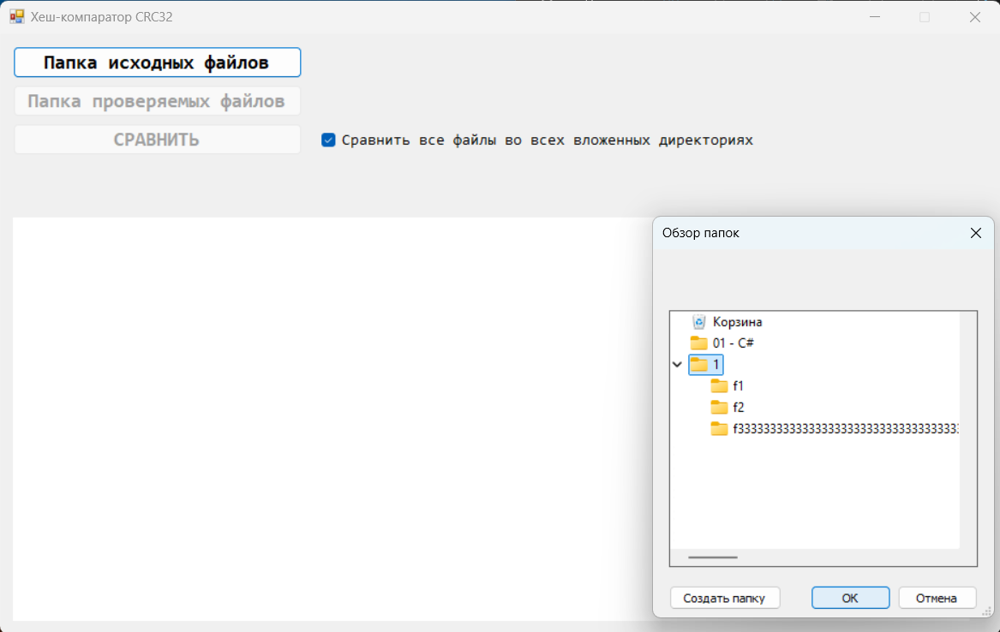
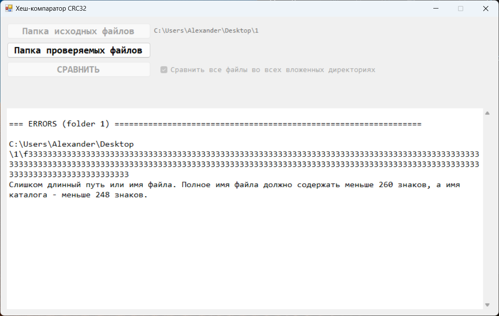

# CRC32 HashComparator
 Это простая программа для получения и сравнения контрольной суммы (CRC32) файлов из двух папок. \
 Выводит результат сравнения каждого файла, а также итог сравнения всех файлов (в текстовом виде).\
\

\

\

\

\

\
