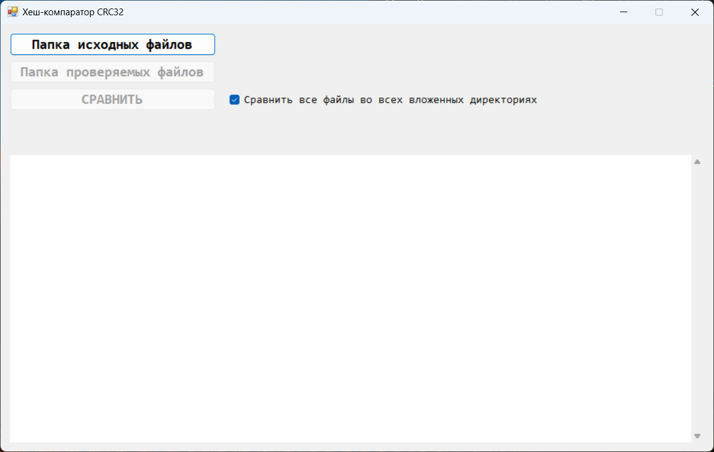

# CRC32 HashComparator
 It is a simple program for getting and comparing the checksum (CRC32) of files from two folders. \
 Displays the result of comparing each file, as well as the result of comparing all files (in text form). \
\

\

\
